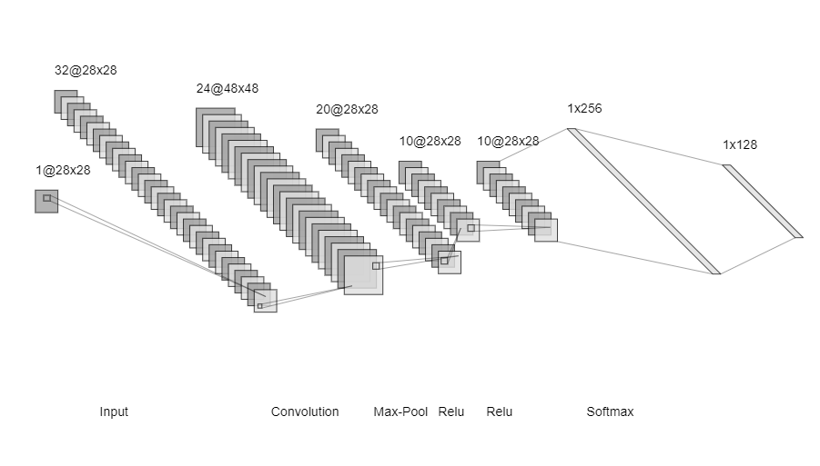
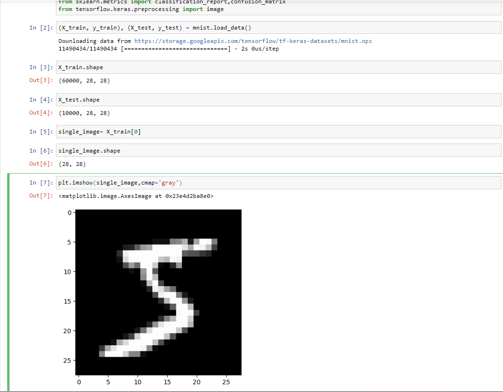
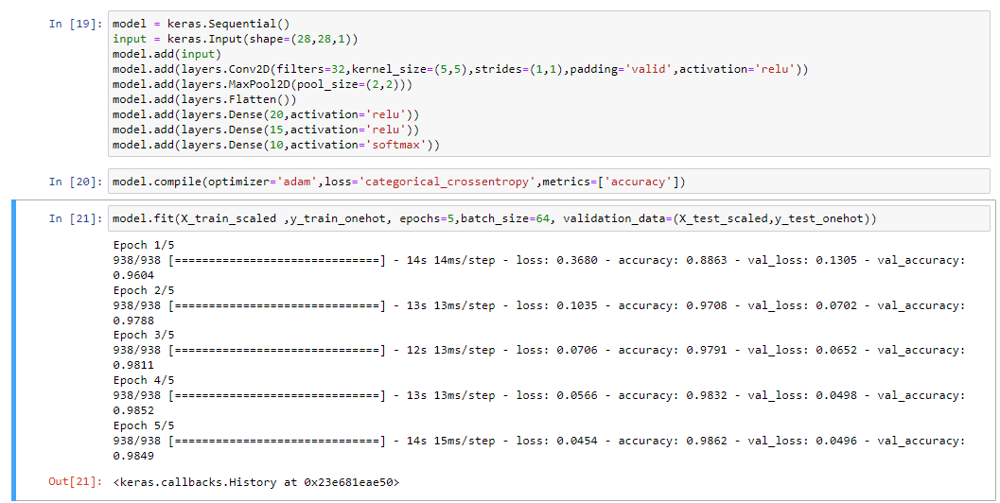
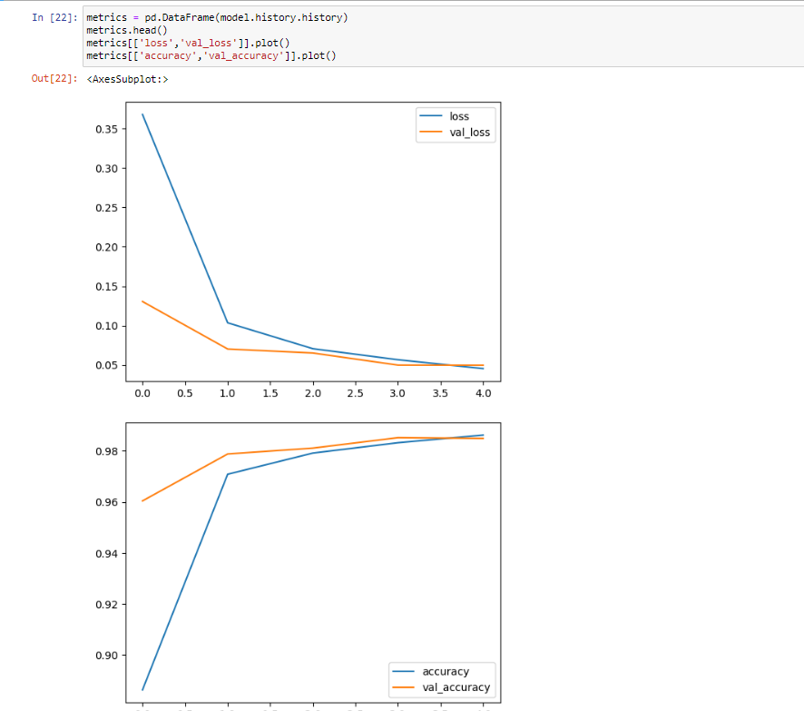
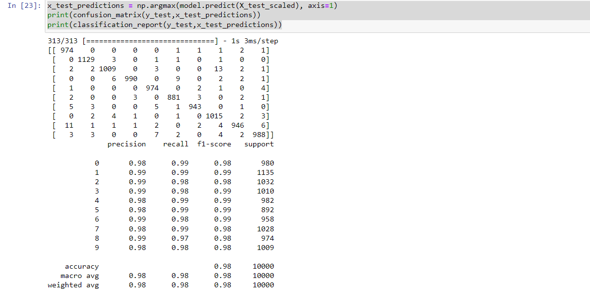

# Convolutional Deep Neural Network for Digit Classification

## AIM

To Develop a convolutional deep neural network for digit classification and to verify the response for scanned handwritten images.

## Problem Statement and Dataset

Digit classification and to verify the response for scanned handwritten images.

The MNIST dataset is a collection of handwritten digits. The task is to classify a given image of a handwritten digit into one of 10 classes representing integer values from 0 to 9, inclusively. The dataset has a collection of 60,000 handwrittend digits of size 28 X 28. Here we build a convolutional neural network model that is able to classify to it's appropriate numerical value.

## Neural Network Model



## DESIGN STEPS

### STEP 1: import all required libraries.

### STEP 2: split data into training and testing.

### STEP 3: create a convolutional nueral network.

### STEP 4: complie and fit the data. Predict the data.

## PROGRAM

```
# AADHEESHWAR A
# 212221230001

import numpy as np
from tensorflow import keras
from tensorflow.keras import layers
from tensorflow.keras.datasets import mnist
import tensorflow as tf
import matplotlib.pyplot as plt
from tensorflow.keras import utils
import pandas as pd
from sklearn.metrics import classification_report,confusion_matrix
from tensorflow.keras.preprocessing import image

(X_train, y_train), (X_test, y_test) = mnist.load_data()
single_image= X_train[0]
plt.imshow(single_image,cmap='gray')
X_train_scaled = X_train/255.0
X_test_scaled = X_test/255.0

y_train_onehot = utils.to_categorical(y_train,10)
y_test_onehot = utils.to_categorical(y_test,10)

X_train_scaled = X_train_scaled.reshape(-1,28,28,1)
X_test_scaled = X_test_scaled.reshape(-1,28,28,1)

model = keras.Sequential()
input = keras.Input(shape=(28,28,1))
model.add(input)
model.add(layers.Conv2D(filters=32,kernel_size=(5,5),strides=(1,1),padding='valid',activation='relu'))
model.add(layers.MaxPool2D(pool_size=(2,2)))
model.add(layers.Flatten())
model.add(layers.Dense(20,activation='relu'))
model.add(layers.Dense(15,activation='relu'))
model.add(layers.Dense(10,activation='softmax'))
model.compile(optimizer='adam',loss='categorical_crossentropy',metrics=['accuracy'])
model.fit(X_train_scaled ,y_train_onehot, epochs=5,batch_size=64, validation_data=(X_test_scaled,y_test_onehot))

metrics = pd.DataFrame(model.history.history)
metrics.head()
metrics[['loss','val_loss']].plot()
metrics[['accuracy','val_accuracy']].plot()

x_test_predictions = np.argmax(model.predict(X_test_scaled), axis=1)
print(confusion_matrix(y_test,x_test_predictions))
print(classification_report(y_test,x_test_predictions))

```

## OUTPUT



### Training Loss, Validation Loss Vs Iteration Plot




### Classification Report and Confusion Matrix



## RESULT

A convolutional deep neural network for digit classification and to verify the response for scanned handwritten images is developed sucessfully.
